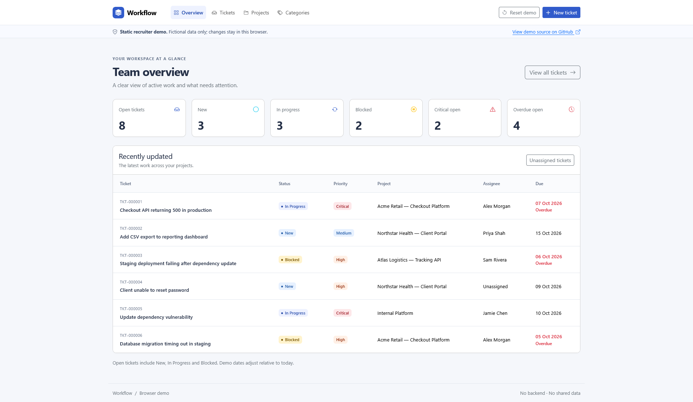

# Workflow Ticket System Demo

A fast, functional recruiter demo of a lightweight internal ticketing system for a software development team.

**[Open the live demo →](https://workflow-ticket-system-demo.vercel.app/)**

Create tickets, edit them, search and filter the queue, change priorities and statuses, delete work, refresh the page and keep your changes, then use **Reset Demo** to restore the original fictional dataset.

[](https://workflow-ticket-system-demo.vercel.app/)

## Why this exists

This started with an old Flask/SQLAlchemy task-manager project I had built while learning.

It worked, but as a portfolio piece it was pretty basic — and, frankly, a bit boring.

I wanted to see how quickly I could turn that starting point into something that felt more like a real internal software product: clear enough to understand immediately, useful enough to interact with, and safe enough to put in front of a recruiter.

Using **OpenAI Codex as an implementation partner**, I redesigned the idea around a small software team's actual workflow. Once the backend project had been refactored, I built this separate public recruiter demo in **under an hour**.

The point was not to build a Jira clone. It was to show how quickly I can take an existing codebase, define a better product direction, use AI effectively, make sensible technical decisions and get to a working result.

## What you can try

The demo supports:

- dashboard metrics for active work
- ticket creation and editing
- status, priority and ownership changes
- search by ticket number, title, description or assignee
- filtering by status, priority, type and project
- ticket detail pages
- delete confirmation
- project and category reference views
- responsive desktop and mobile layouts
- browser-local persistence with `localStorage`
- one-click **Reset Demo**

The fictional workflow covers realistic software-team work such as:

- production bugs
- support requests
- feature work
- deployment problems
- infrastructure issues
- internal development tasks

## Built quickly, not carelessly

The speed was deliberate, but so were the constraints.

I kept the public demo intentionally simple:

- HTML, CSS and vanilla JavaScript
- Bootstrap 5 and Bootstrap Icons
- no framework build step
- no backend
- no database
- no API keys
- no application secrets
- no shared writable state

Every visitor gets their own browser-local copy of the fictional data. Nothing they change can affect another visitor.

That separation matters because the fuller version of the project was developed with Flask, SQLAlchemy, migrations, server-side validation, CSRF protection, transaction handling and automated tests. The backend implementation is maintained separately from this public recruiter demo.

## Where AI helped

I used Codex to accelerate implementation, refactoring and repetitive development work.

My role was to define the product direction, decide what belonged in scope, review the generated code, test the behaviour, set the safety boundaries, correct weak decisions and decide when the project was good enough to ship.

That is the part of AI-assisted development I find most useful: not asking AI to invent a project for me, but using it to move much faster from an idea and an existing codebase to a working, reviewable result.

## Demo architecture

```text
Browser
  │
  ├── index.html
  ├── Bootstrap 5
  ├── styles.css
  └── app.js
        │
        └── localStorage
             └── fictional ticket data

No server
No database
No API
No credentials
```

## Example data

The demo includes fictional projects such as:

- Acme Retail — Checkout Platform
- Northstar Health — Client Portal
- Atlas Logistics — Tracking API
- Internal Platform

Example tickets include:

- Checkout API returning 500 in production
- Staging deployment failing after dependency update
- Client unable to reset password
- Database migration timing out in staging
- Add CSV export to reporting dashboard

All names and scenarios are fictional.

## Run locally

There are no dependencies and no build step.

```bash
python -m http.server 8000
```

Then open `http://localhost:8000`.

---

**[Try the live demo →](https://workflow-ticket-system-demo.vercel.app/)**
